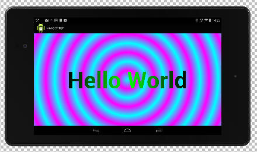

# CE881 Lab 1: Introduction

## Introduction

The aim of this lab is to gain familiarity with using a Java IDE together with the Android development tools.  You are assumed to be familiar with Java and Java IDEs in general, and ideally with Eclipse or Intellij in particular.  If not then seek assistance from the lab or module supervisor

The lab will work through various versions of a Hello World program and introduce some important concepts in the process, finishing off with a quiz.  Concepts include:

* Building and running a Hello World program
* Defining a custom view component
* Editing XML files to create a GUI
* Drawing text and setting various Paint parameters
* Simple event handling

## Hello World

Download [Android Studio](http://developer.android.com/sdk/index.html)

